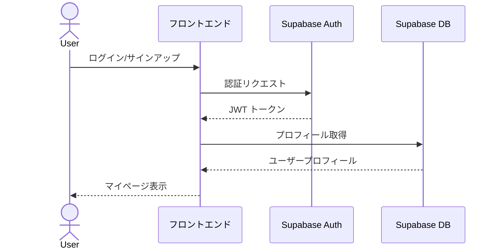
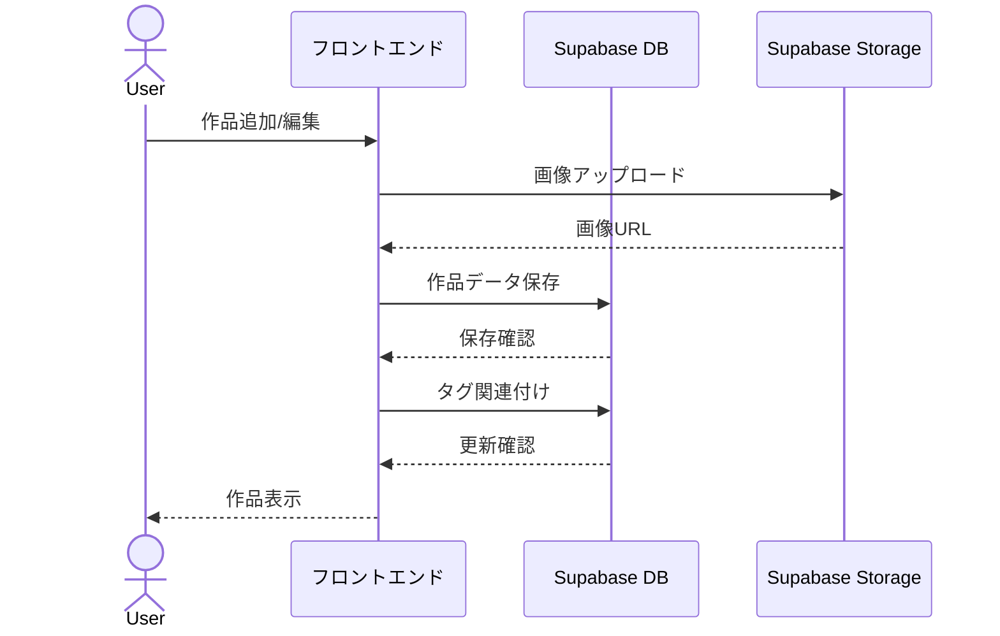
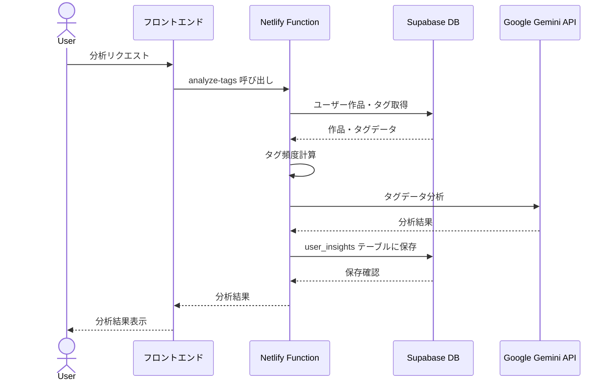
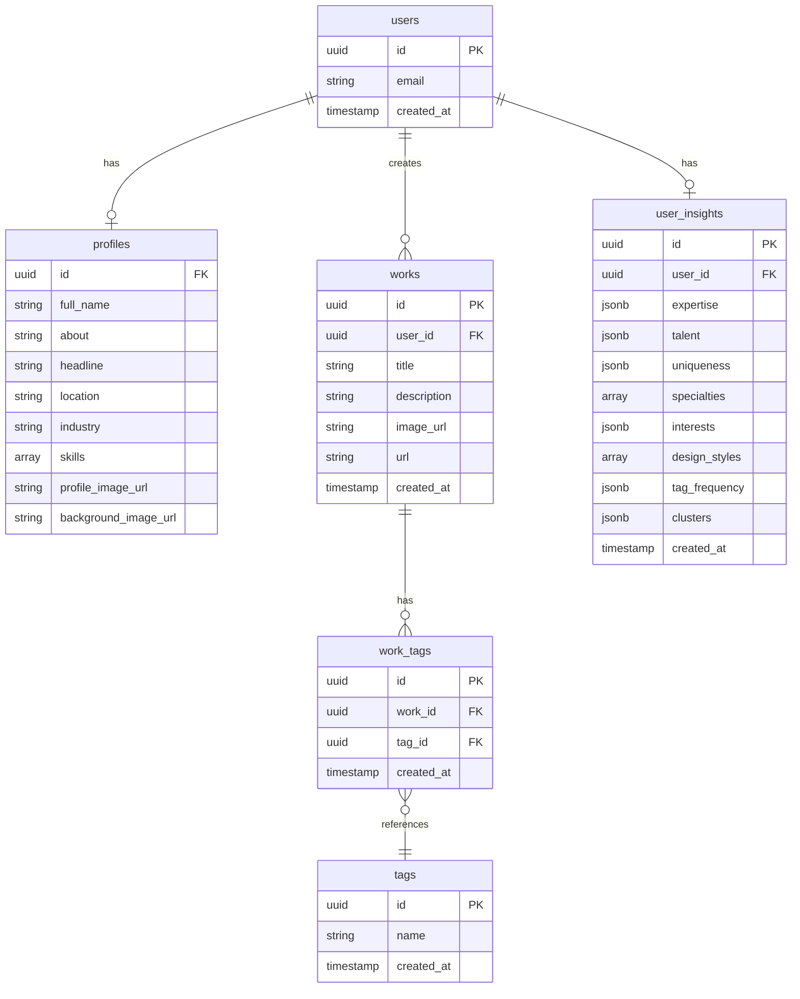
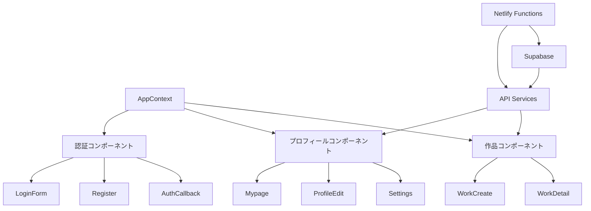
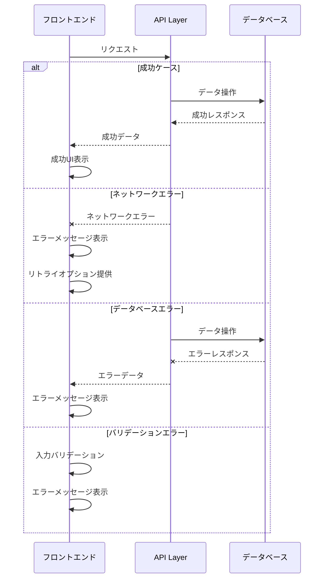
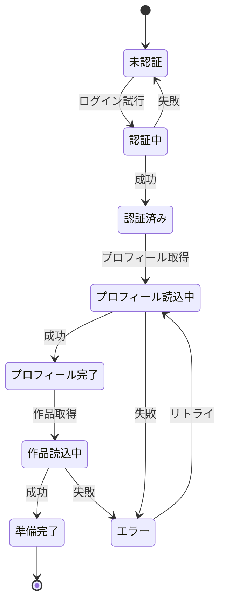

# Balubo データフロー図

## ユーザー認証フロー

```mermaid
sequenceDiagram
    actor User
    participant UI as フロントエンド
    participant Auth as Supabase Auth
    participant DB as Supabase DB
    
    User->>UI: ログイン/サインアップ
    UI->>Auth: 認証リクエスト
    Auth-->>UI: JWT トークン
    UI->>DB: プロフィール取得
    DB-->>UI: ユーザープロフィール
    UI-->>User: マイページ表示
```

## 作品管理フロー

```mermaid
sequenceDiagram
    actor User
    participant UI as フロントエンド
    participant DB as Supabase DB
    participant Storage as Supabase Storage
    
    User->>UI: 作品追加/編集
    UI->>Storage: 画像アップロード
    Storage-->>UI: 画像URL
    UI->>DB: 作品データ保存
    DB-->>UI: 保存確認
    UI->>DB: タグ関連付け
    DB-->>UI: 更新確認
    UI-->>User: 作品表示
```

## AI分析フロー

```mermaid
sequenceDiagram
    actor User
    participant UI as フロントエンド
    participant Function as Netlify Function
    participant DB as Supabase DB
    participant Gemini as Google Gemini API
    
    User->>UI: 分析リクエスト
    UI->>Function: analyze-tags 呼び出し
    Function->>DB: ユーザー作品・タグ取得
    DB-->>Function: 作品・タグデータ
    Function->>Function: タグ頻度計算
    Function->>Gemini: タグデータ分析
    Gemini-->>Function: 分析結果
    Function->>DB: user_insights テーブルに保存
    DB-->>Function: 保存確認
    Function-->>UI: 分析結果
    UI-->>User: 分析結果表示
```

## データベース関連図

```mermaid
erDiagram
    users ||--o| profiles : has
    users ||--o{ works : creates
    works ||--o{ work_tags : has
    work_tags }o--|| tags : references
    users ||--o| user_insights : has
    
    users {
        uuid id PK
        string email
        timestamp created_at
    }
    
    profiles {
        uuid id FK
        string full_name
        string about
        string headline
        string location
        string industry
        array skills
        string profile_image_url
        string background_image_url
    }
    
    works {
        uuid id PK
        uuid user_id FK
        string title
        string description
        string image_url
        string url
        timestamp created_at
    }
    
    tags {
        uuid id PK
        string name
        timestamp created_at
    }
    
    work_tags {
        uuid id PK
        uuid work_id FK
        uuid tag_id FK
        timestamp created_at
    }
    
    user_insights {
        uuid id PK
        uuid user_id FK
        jsonb expertise
        jsonb talent
        jsonb uniqueness
        array specialties
        jsonb interests
        array design_styles
        jsonb tag_frequency
        jsonb clusters
        timestamp created_at
    }
```

## コンポーネント間データフロー

```mermaid
flowchart TD
    A[AppContext] --> B[認証コンポーネント]
    A --> C[プロフィールコンポーネント]
    A --> D[作品コンポーネント]
    
    B --> B1[LoginForm]
    B --> B2[Register]
    B --> B3[AuthCallback]
    
    C --> C1[Mypage]
    C --> C2[ProfileEdit]
    C --> C3[Settings]
    
    D --> D1[WorkCreate]
    D --> D2[WorkDetail]
    
    E[API Services] --> C
    E --> D
    
    F[Supabase] --> E
    
    G[Netlify Functions] --> E
    G --> F
```

## エラーハンドリングフロー

```mermaid
sequenceDiagram
    participant UI as フロントエンド
    participant API as API Layer
    participant DB as データベース
    
    UI->>API: リクエスト
    
    alt 成功ケース
        API->>DB: データ操作
        DB-->>API: 成功レスポンス
        API-->>UI: 成功データ
        UI->>UI: 成功UI表示
    else ネットワークエラー
        API--xUI: ネットワークエラー
        UI->>UI: エラーメッセージ表示
        UI->>UI: リトライオプション提供
    else データベースエラー
        API->>DB: データ操作
        DB--xAPI: エラーレスポンス
        API-->>UI: エラーデータ
        UI->>UI: エラーメッセージ表示
    else バリデーションエラー
        UI->>UI: 入力バリデーション
        UI->>UI: エラーメッセージ表示
    end
```

## 状態管理フロー

```mermaid
stateDiagram-v2
    [*] --> 未認証
    未認証 --> 認証中: ログイン試行
    認証中 --> 認証済み: 成功
    認証中 --> 未認証: 失敗
    認証済み --> プロフィール読込中: プロフィール取得
    プロフィール読込中 --> プロフィール完了: 成功
    プロフィール読込中 --> エラー: 失敗
    エラー --> プロフィール読込中: リトライ
    プロフィール完了 --> 作品読込中: 作品取得
    作品読込中 --> 準備完了: 成功
    作品読込中 --> エラー: 失敗
    準備完了 --> [*]
```
